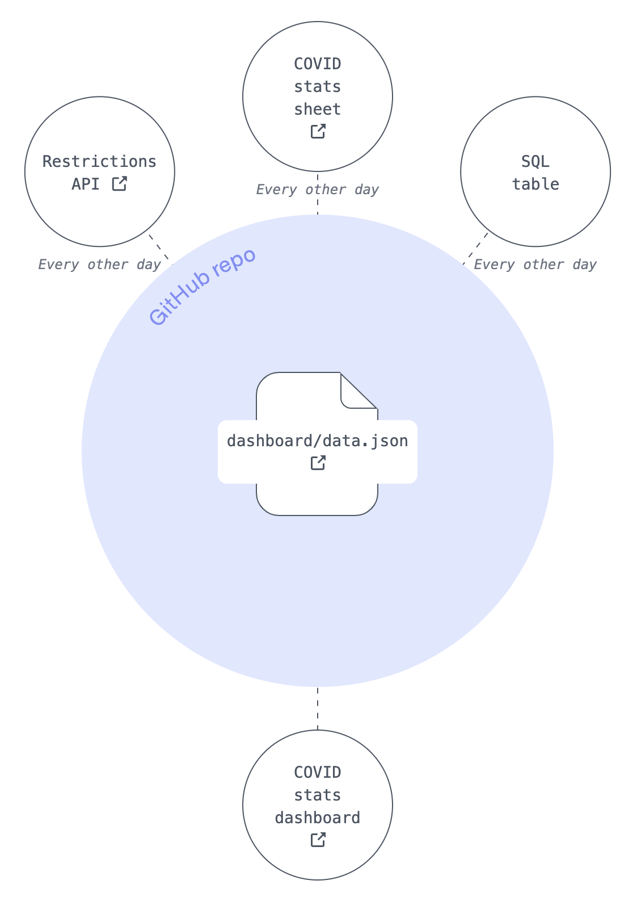

# Flat Data Demo: COVID Dashboard

This demo is part of a larger Flat Data project created by [GitHub OCTO](https://octo.github.com/). Read more about the project [here](https://octo.github.com/projects/flat-data).

The generated app lives at [https://githubocto.github.io/flat-demo-covid-dashboard/](https://githubocto.github.io/flat-demo-covid-dashboard/).

## What this demo does

This uses a Flat Action to fetch data about COVID-19 and display it in a dashboard. It's a great example of how to:

- load data from different sources (both HTTP & SQL)

- merge that data into one `data.json` file

- create a dashboard on top of that data

